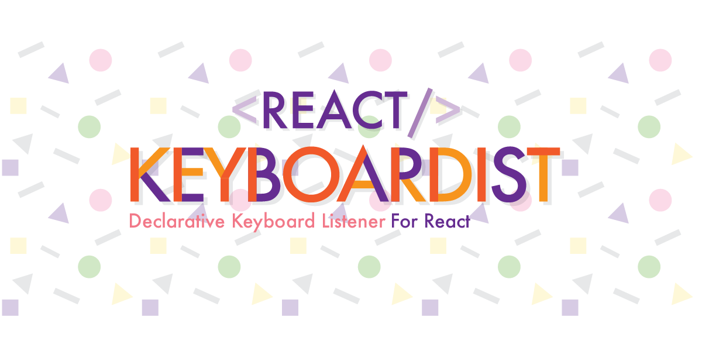

# 🎹 React Keyboardist



React Keyboardist offers a simple and declarative way to add keyboard shortcuts to your react applications. It is just a React Wrapper for [🎹Keyboardist](https://github.com/soska/keyboardist.js).

[Click here for a simple demo](http://soska.github.io/react-keyboardist/docs/index.html)

## Installation

```
$ yarn add react-keyboardist

or

$ npm install --save react-keyboardist
```

## How to use

Just pass a dictionary with the shape of `{keyName : [function]}` via the `bindings` property and they will be automatically binded when the component mounts.

```javascript
import Keyboardist from 'react-keyboardist';

class App extends React.Component {
  //... state methods would go here

  render() {
    return (
      <React.Fragment>
        <Keyboardist
          bindings={{
            Slash: this.focusSearch,
            Period: this.showMenu,
            Escape: this.logOut,
            KeyK: this.next,
            KeyJ: this.prev,
          }}
        />
        <RestOfTheApp />
      </React.Fragment>
    );
  }
}
```

All the subscription objects will be automatically unsuscribed when the component unmounts so you can use it as any other component in your component hierarchy.

## Other Events

By default React Keyboardist will listen to `keydown` events, but you can use `keyup` instead.

```javascript
<Keyboardist
  eventName="keyup"
  bindings={{
    Slash: this.focusSearch,
    Period: this.showMenu,
    Escape: this.logOut,
    KeyK: this.next,
    KeyJ: this.prev,
  }}
/>
```

## Multiple listeners for a Key

You can add multiple listeners for the same key, and they will be executed
starting from the last one. If one of the listeners returns `false` the execution chain will stop. This is useful when you want to override a key in a child component.

```javascript
const App = ({ openDialog, closeDialog, isDialogOpen, handleLogout }) => (
  <div>
    <Keyboardist
      bindings={{
        Enter: openDialog,
        Escape: handleLogout,
      }}
    />
    {isDialogOpen && <ModalDialog onClose={closeDialog} />}
  </div>
);

const ModalDialog = ({ onClose }) => (
  <div className="dialog">
    <Keyboard
      bindings={{
        Escape: () => {
          onClose();
          // this will prevent the Escape binding in the parent component to be triggered.
          return false;
        },
      }}
    />
    <DialogContentOrWhatever />
  </div>
);
```

## Key Monitor

The `monitor` property allows you to either pass a monitor function or just set it to `true` to use Keyboardist's default monitor. You can [read more about Keyboardist monitor over here.](https://github.com/soska/keyboardist.js#key-monitor)

```javascript
<Keyboardist
  bindings={{
    Enter: openDialog,
    Escape: handleLogout,
  }}
  monitor={(keyName, matched) => {
    // do something
  }}
/>
```
